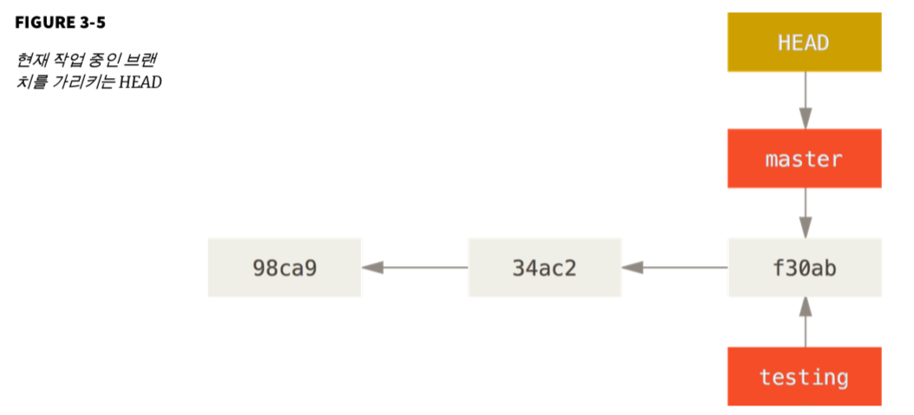
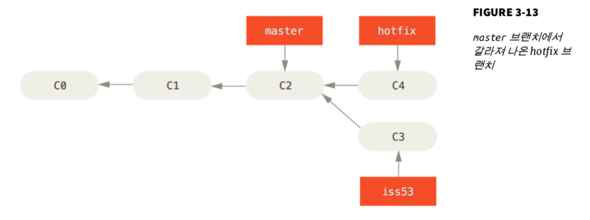
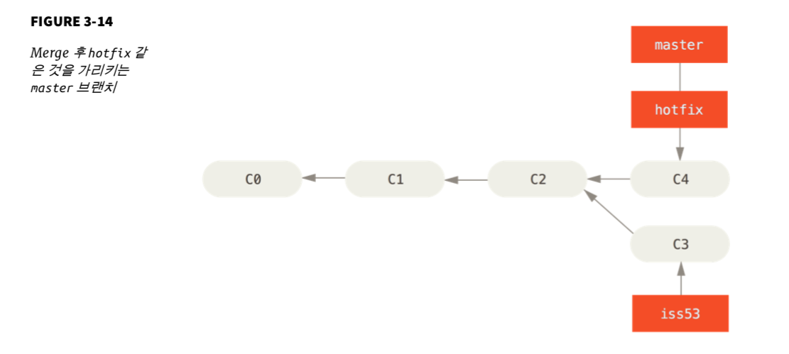
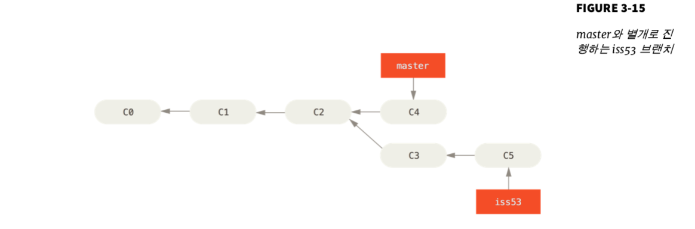
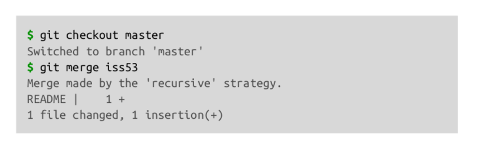
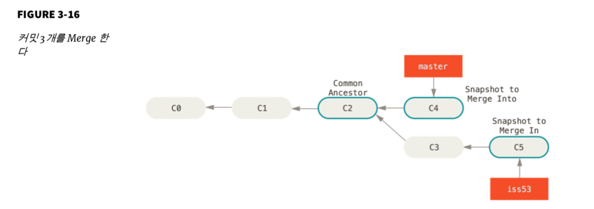
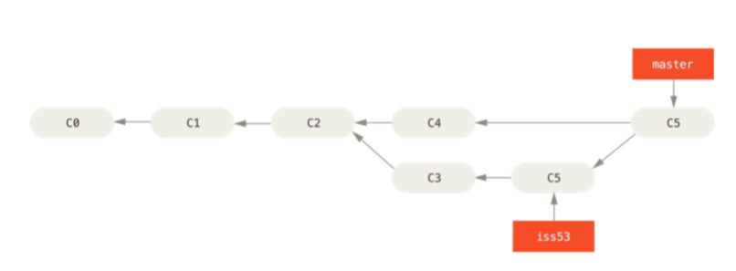
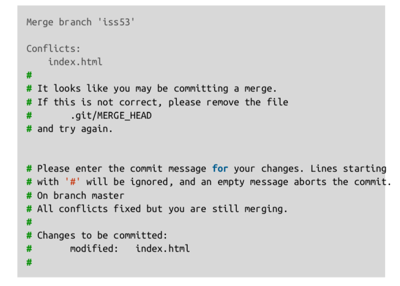

# Pro Git 2.0


## 3. Git 브랜치

원래 코드와 상관없이 독립적으로 개발을 진행할 수 있는데, 이렇게 독립적으로 개발하는 것이 브랜치이다.

Git은 브랜치를 만들어 작업ㅇ하고 나중에 Merge 하는 방법을 권장한다.


### 브랜치란 무엇인가

Git 브랜치는 커밋 사이를 가볍게 이동할 수 있는 어떤 포인터 같은 것이다.

브랜치를 만들 때 마다 브랜치가 자동으로 가장 마지막 커밋을 가리키게 된다.


<testing 브랜치를 만들었을 때, master가 가리키는 가장 마지막 커밋인 `f30ab`를 가리키게 된다.>


지금 작업중인 브랜치가 무엇인지 GIT은 어떻게 파악할 까?

GIt은 HEAD라는 특수한 포인터가 있다. 이 포인터는 지금 작업하는 로컬 브랜치를 가리킨다. 위에서는 testing 이라는 브랜치를 만들 었지만, 아직 master 브랜치를 가리키고 있다. 즉, HEAD는 master 이다. 그림으로 나타내면 다음과 같다.



```shell
git log --oneline —decorate #브랜치가 어떤 커밋을 가리키는지 확인 할 수 있다.
```


파일을 수정하고 다시 커밋을 해보면,

```shell
$ vim test.rb
$ git commit -a -m 'made other change'
```


HEAD가 가리키고 있는 master 브랜치의 커밋 `f30ab` 에서 새로운 커밋이 생겨나고, master와 HEAD는 최신 커밋 가리킨다.

깃에서 브랜치를 하나 만들 때 41바이트 크기의 파일을 하나 만드는 것에 불과 하기 때문에(40글자의 sha-1 체크섬 파일에 불과) 프로젝트의 크기에 따라서 통째로 복사하는 경우가 발생할 때, 생기는 문제를 해결할 수 있다.


### 브랜치와 Merge의 기초

1. 작업 중인 웹사이트가 있다.
2. 새로운 이슈를 처리할 새 branch를 하나 생성한다.
3. 새로 만든 branch에서 작업을 진행한다.
   * 이때 중요한 문제가 생기면 그것을 해결하는 Hotfix를 먼저 만들어야 한다.
     1. 새로운 이슈슬 처리하기 이전의 운영(Production) 브랜치로 이동한다.
     2. Hotfix 브랜치를 새로 하나 생성한다.
     3. 수정한 Hotfix 테스트를 마치고 운영 브랜치로 Merge 한다.
     4. 다시 작업하던 브랜치로 옮겨가서 하던 일 진행한다.


### 브랜치의 기초


* 이 상황에서 프로덕션에 문제가 생겨서 즉시 고쳐야하는 상황일 때,
  * 버그를 해결한 Hotfix에 iss53이 섞이는 것을 방지하기 위해서 iss53 관련 코드는 어딘가에 저장해두고 원래 운영 환경의 소스로 복구해야한다. GIt을 사용하면 이런 노력 들일 필요 없이 그냥 브랜치로 옮기면 된다.
    * 이때, 브랜치를 이동하기 전에 알아야할 거승ㄴ 아직 커밋하지 않은 파일이 checkout 할 브랜치와 충돌 나면 브랜치를 변경할 수 없다는점이고, 브랜치를 변경할 떄는 워킹 디렉토리를 정리해야한다. stashing과 cleaning 하는 방법이 있는데, 일단은 commit을 모두 하고 master로 옮긴다
  * Git은 자동을 ㅗ워킹 디렉토리에 파일들을 추가하고, 지우고, 수정해서 checkout한 브랜치의 마지막 스냅샷으로 되돌려 놓는다.




#### Fast-forward

위 그림에서 Merge 할 브랜치가 가리키는 커밋이 현 브랜치 커밋의 Upstream 브랜치이기 때문에 master 브랜치 포인터는 최신 커밋으로 이동한다. 이런 Merge 방식을 Fast forward라고 부른다. A브랜치에서 다른 B 브랜치를 Merge 할 때 B가 A 이후의 커밋을 가리키고 있으면 그저 A가 B의 커밋을 가리키게 할 뿐이다. -> 아래 그림 참조




작업을 완료하면, 다시 일하던 브랜치로 돌아가야 하는데, 더 이상 필요없는 hotfix 브랜치는 삭제한다. 그리고 checkout명령어로 다시 iss53 브랜치로 이동한 후, 하던 작업을 하고, 커밋을 한다. -> 결과는 아래 그림



### Merge의 기초

Git merge 명령으로 합칠 브랜치에서 합쳐질 브랜치를 Merge 하면 된다.



이 경우에는 현재 브랜치가 가리키는 커밋이 merge 할 브랜치의 조상이 아니므로(딱 봐도 확인 가능) Fast-forward로 merge 하지 않는다. 이 경우 각 브랜치가 가리키는 커밋 두 개와 공통 조상 하나를 사용하여 3-Way Merge를 한다. -> 아래 그림



Fast-forward와 다르게, 이 경우는 3-way Merge의 결과를 별도의 커밋으로 만들고 나서, 해당 브랜치가 그 커밋을 가리키도록 이동시킨다 그래서 이런 커밋은 부모가 여러개고 Merge 커밋이라고 부른다.



### 충돌의 기초

3-way merge가 실패하는 경우는 merge 하는 두 브랜치에서 같은 파일의 한 부분을 동시에 수정하고 merge 하면 git은 해당 부분을 merge 하지 못한다. git은 자동으로 merge 하지 못해서 새 커밋이 새애기지 않는다. 변경사항의 충돌을 개발자가 해결하지 않는 한 Merge 과정을 진행할 수 없다.

merge충돌이 났을 때, git이 어떤 파일을 merge 할 수 없었는지 살펴보려면 git status 명령을 이용한다.

충돌이 일어난 파일은 unmerged 상태로 표시된다. 개발자는 충돌난 부분을 수동으로 해결해야한다.

충돌을 해결하고 나서 해당 파일이 staging area에 저장됐는지 확인했으면 git commit 명령으로 merge 한 것을 커밋한다.

충돌을 해결하고 merge 할때 에는 커밋 메시지가 아래와 같다.



이때 중요한 것은 어떻게 충돌을 해결했고 좀 더 확인해야 하는 부분은 무엇이고 왜 그렇게 해결했는지에 대해서 자세하게 기록한다. 이를 통해서 나중에 이 merge 커밋을 이해하는데 도움을 준다.


### 브랜치 관리

```shell
git branch #브랜치의 목록을 보여준다.
git branch -v #브랜치의 마지막 커밋을 보여준다.
git branch --merged #체크아웃한 브랜치를 기준으로 merge 된 브랜치인지 아닌지 필터링 할 수있다.
git branch -d testing #merge 하지 않은 브랜치를 강제 삭제

```


## 모르는 것들


1. git commit을 할 때 벌어지는 일들